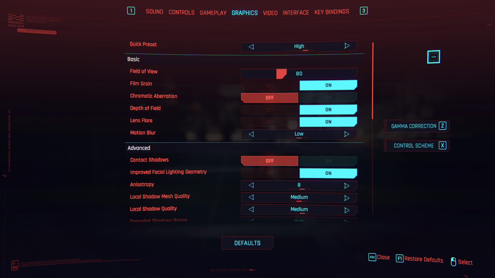

+++
title = 'A Game Developers Guide to Gaming Laptops'
date = 2024-07-17T21:13:32+01:00
draft = true
+++

A frame, *as in frames-per-second*  is made up of (1920 x 1080) 2,073,600 pixels for a 1080p display. Line up 60 frames in sequence before our eyeballs and you achieve a [zoetropian](https://en.wikipedia.org/wiki/Zoetrope) illusion of motion. The pixels that make up the *frame* need to be calculated at blistering fast speeds - for 60fps, that ‘s under 16.67 milliseconds! For comparison, the average human blink takes [100-150ms](https://www.ucl.ac.uk/news/2005/jul/blink-and-you-miss-it).

By understanding which components make a pixel display on screen, we hope to understand which ones to beef up to meet our gaming needs - and where to compromise.  

For background, I've been a professional game developer since 2012 and have programmed gameplay logic, UI systems, graphics, physics and performance optimisation. I helped optimise CSR2, a mobile game with [console graphics](https://venturebeat.com/games/csr-racing-2-and-its-beyond-console-graphics-launch-on-ios-and-android/) capable of running on an iPhone 6 (the latest iPhone at the time).



## A very brief lesson on the journey of a pixel

The journey begins with the storage drive, where your game code, 3D models, shaders, scenes and textures reside. These files are transferred to RAM, where they can be accessed by the CPU billions of times faster than SSD. The CPU constructs the scene, known as a scene hierarchy and then applies physics, AI and other game logic to determine the positions of 3D models. The CPU uses this scene hierarchy, along with information on lights, cameras and materials to instruct the GPU on what to render. This list of instructions is called a [command buffer](https://developer.nvidia.com/blog/advanced-api-performance-command-buffers/)**.** 

You may have heard the term “hardware accelerated”. That's because before the advent of the GPU the CPU did everything beyond this stage - all the complex maths for transforming triangles on to position in the viewport (screen), texture lookups and shading pixels for depth and lighting. The hardware accelerated part comes from offloading operations to dedicated hardware, vastly accelerating the work achieved in any given time frame. 

The CPU is a general purpose processor, whereas the GPU dedicated for the processing maths involved in rendering. For this dedication it foregoes certain functionality, like reading lots of different file formats but excels at massively parallelising the operations it does do - here's a fun video illustrating the concept:



This journey, excluding the step from storage to RAM, happens every frame. If this journey takes more than 1000/(# frames per second) milliseconds then you'll experience frame drops i.e poor gaming experience. For 60 fps that 1000/60 = 16.67ms 😟 

## What's a bottleneck?

A component in the rendering pipeline may not finish its tasks in the target frame time, causing a backlog while other components are underutilized. It's like a 4-lane highway narrowing to 2 lanes—adding a 5th lane doesn't solve the congestion. The symptom of which in games is choppy gameplay and unresponsive input, amongst other undesirable artifacts.

Let's run through those components and see how they contribute to, or bottleneck, your gaming experience

## What's a Storage Drive responsible for?

- Persistent storage of files. This includes:
    - The games assets
    - Game save files
    - DLC content, such as expansions and videos

### Why would you want a fast hard drive?

- Programs (including games!) will open quicker
- Scenes load quicker
- Writing to disk, i.e saving games, will be quicker
- More storage = more programs (and games!) can be stored on your device

### Is it worth the spend?

    <canvas id="storage-internal-vs-external-chart"></canvas>

  

If you're happy to offload non-game files to external storage (such as personal videos, photos, documents) and prioritise internal storage for games, then there's a big saving to be made.

There is however, a qualitive aspect to the convenience on internal storage as well future proofing for system and program updates.

## What's RAM responsible for

- RAM provides volatile, fast access to files and code for the GPU (compared with a storage device)
- Temporary storage of data used in algorithms

### Why would you want lots of fast RAM?

- High RAM will reduce the chance of page swaps - an operation carried out by the operating system to use the slower disk storage for memory.
- The chance of page swap is affected by the number of programs open - e.g browsers, chat and screen recorders etc
- When RAM is critically low the operating system might close your program entirely! (known as an out-of-memory exception)

### Is it worth the spend?

Games usually come with a system requirements, for example, Cyberpunk 2077 requires 12GB whilst a more casual game like Fall Guys requires 8GB. Bear in mind the operating system needs (approximately 4GB) and any other programs you have in the background. 

RAM used to be is one of the few components that could easily upgraded but we're seeing a trend towards soldered RAM, thereby reducing upgradability. Whilst I don't have a rule of thumb, it'd be prudent to look at the system requirements of the games you play most, add an additional 4GB for the operating system then doubling for future proofing. For Cyberpunk that would mean (12GB + 4GB) * 2 = 32GB 

## What's the CPU responsible for?

The CPU is a general processing unit, meaning it can do it all.. even rendering! However, here's a list of what the CPU is typically responsible for in a game:

- File I/O , such as loading 3D environments and audio, and saving game state.
- Physics, e.g ragdolls, locomotives, projectiles and destructibles
- Game logic, such as damage dealt,  l
- UI data (not rendering of), such as health cars, inventory, scene selection, HUDs
- Updating player stats, e.g health, XP
- Animations
- AI logic, including enemy behaviour,
- Input handling
- Game loop execution
- Networking
- Constructing the draw call - a per frame operation instructing the GPU on what to draw

### What type of games use lots of CPU?

- Physics-based games. The more maths you can squeeze in per frame, the more realistic and smoother the physics
- Strategy games that involve many units with complex AI behaviour

### Clock speed vs number of cores

To compare apples with apples among CPUs, I like to look at these two metrics. If a game isn't built with an an engine that utilises multi-threading, then cores will sit idle and unused. Utilising more cores means more parallel-processing which results in greater bandwidth and less chance of frame drops. However, game logic often needs to run in sequence, e.g read user input, then calculate new player position, then update physics, then update camera and so forth, so there's not much work that naturally lends itself well to parallelising.

That being said, certain tasks do lend well, such as networking, loading/saving files and audio. Thankfully Unity and Unreal make partial use of threads. The rest however, is developer dependant. 

### Why not just increase clock speeds?

Clock speeds did increase almost exponentially year-on-year up until the mid-2000s, but due to heat, energy efficiency requirements and physical limitations of electrons, chip makers invented a new way of increasing performance: more cores. The (very brief) idea is to deploy multiple CPU cores running at lower speeds but processing in parallel.

### Is it worth the spend?

As established, one clock speed limiting factor is temperature and there are cheap ways to cool a laptop, such as a stand. This prevents **throttling**, a process where CPUs are underclocked to prevent damage. 

Games that simulate lots of objects (RTS games for example) will consume a fair chunk of CPU, as will   games that rely on high resolution physics. 

If loading times are important then a fast SSD + CPU combo will areas to focus on.

## What's the GPU for?

- Rendering UI
- Rendering the environments, such as terrain, foliage and water
- Rendering characters
- Post processing effects, such as volumetric lights, screen space reflections, motion blur, anti-aliasing, bloom and many more
- Under the hood, the GPU calculates calculates positions of 3D mesh triangles (vertex processing), converts them to pixel position on screen (rasterisation), calculates its colour (fragment processing), figures clipping order and transparency (depth + blending).
- Resolution upscaling - e.g 1080p to 4k

### What types of games make heavy use of the GPU?

- Games with lots of real-time lighting and shadows
- Games with of high texture resolutions (4k and above) and high resolution models
- VR games
- Games with lots of image effects, such as volumetric fog, clouds, motion blur, depth of field
- High levels of anti-aliasing
- Ray-tracing for lighting, reflections and shadows*
- Games that allow you to upscale to higher resolutions, e.g 1080p to 4k**

* Your options will be limited to Nvidia RTX GPUs

** This works by “super sampling” using a neural network algorithm to fill in missing pixels . See [Nvidia DLSS](https://www.nvidia.com/en-gb/geforce/news/nvidia-rtx-games-engines-apps/), [AMD FSR](https://www.amd.com/en/products/graphics/technologies/fidelityfx/supported-games.html) and [Intel XeSS](https://game.intel.com/us/xess-enabled-games/).

### Is it worth the spend?

Most games developers want to maximise their player base meaning supporting as many PCs/laptops as possible. They achieve this by enabling the player the ability to set graphical fidelity. 

The settings that will give you the biggest performance boost would be: reducing resolution, reducing anti-aliasing amount and reducing reflection quality.

So whilst in many cases it will still be possible to play most games with an entry/mid level GPU, you might not be able to play them max settings.

On a personal note, most of the game design I love do not rely on fancy graphics, and the attraction of graphical fidelity tends to fade away as I get more immersed in the story and game play. Also, art style plays a huge role in immersion and physically accurate doesn't always equate to better gameplay. Afterall, games present the opportunity to experience a different reality for a short amount of time, do we really want every single light, camera and character to be so physically accurate that there's no room for artistic interpretation?

## Conclusion

Laptops and their components are marketed with ever increasing numbers and letters that make consumers feel a sense of urgency to stay at the cutting edge. Hopefully this article demystifies some of those numbers and helps you understand what personally matters, be that fast load times, highly accurate physics or raytraced lighting.

{{/*  Source:
https://www.westerndigital.com/en-gb/topics/sandisk/portable-ssd
https://www.razer.com/gb-en/gaming-laptops/Razer-Blade-16/RZ09-05102WN9-R3W1
*/}}