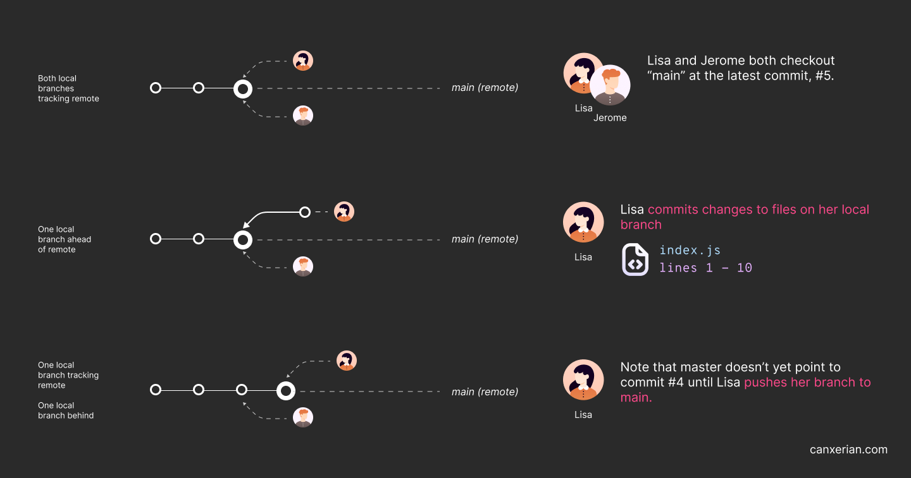
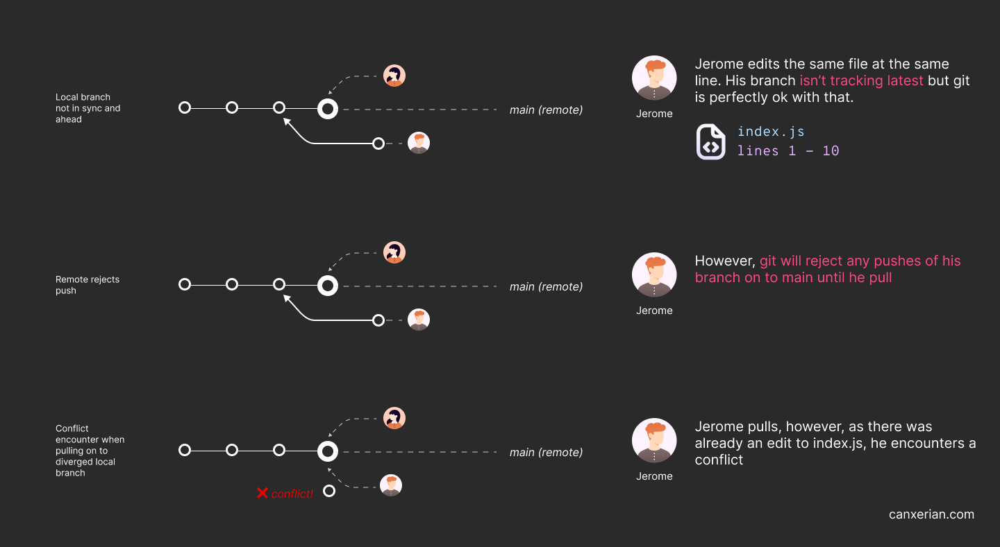

+++
title = 'How to Completely Avoid Git Conflicts'
date = 2024-07-15T14:01:23+01:00
draft = true
+++

It's time to say goodbye to git conflicts for good.

Let’s understand what causes git conflicts and develop strategies to completely avoid, or at least dramatically reduce encountering them.

First, let’s look at a situation that leads to a conflict.

## Simultaneous edits on the same (main) branch

You and a colleague are working on the same branch tracking to your remote git host, (be that GitHub, GitLab or something else). When you checkout the main branch, you both effectively have local copies of that branch - notice that when you commit GitHub (or whatever git hosting provider you use) doesn’t see those changes until you push.

You're both assigned tasks to modify `index.js`. Unfortunately, your colleague completes their task much faster and has already pushed their commit to main.

At a slower pace, you modify and commit `index.js`. When you attempt to push, the remote main branch will reject that command and request that you "pull" (i.e bring your branch up-to-date with remote).

You pull and shock horror, you have a merge conflict!

### Solution

In this situation, had you pulled *before* modifying index.js, the file created by your colleague would appear on your local repo, you can then edit that file and push it back to main.



So push frequently and pull frequently. However, a better solution is having a separate branch per feature (aka feature branch), e.g feature/create-index-html, that could help with multiple developers creating the same thing in isolation. When the feature is ready it can be merged back in to main, ready for for other developers to pull.

## Simultaneous edits on different branches, conflicts on merging

You and a colleague both followed my first advice. You’re working on different features, so you create the branches accordingly. However, you both need to edit index.html and you both need to add some code to line 10. 

You both merrily made your changes and as you both have your own branches, pushing and pulling with no conflicts!

However, your colleague merged their branch back in to main and now your branch is tracking behind so you need to merge main in to your branch to get up to date (called a sync merge).

When you do so you’ll encounter a merge conflict on line 10 in index.html. What! 

### Solution

Merge main in to your branch regularly (aka sync merge). Had you merged main straight after your colleague’s merge, you’d be completing your work on top of their changes. i.e your branch would *already* contain their changes and there’d be no deviation from their work and thus no changes. The longer the time between your last sync merge, the greater chance that you’ll work on an out of date version of a file and the greater the chance of getting a merge.